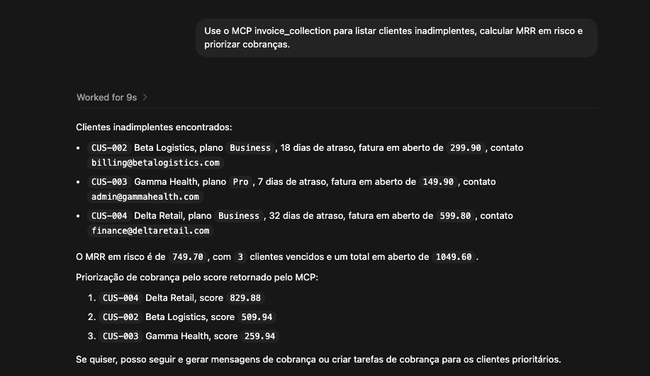
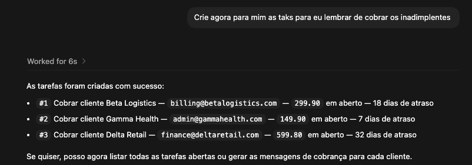
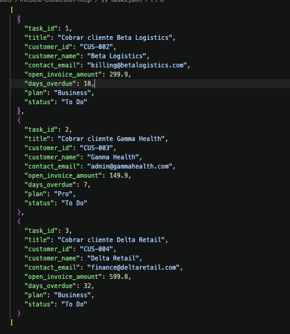

# Invoice Collection MCP

Servidor MCP simples para simular um fluxo de cobrança de clientes inadimplentes em um SaaS.

O projeto expõe ferramentas que ajudam um assistente de IA a responder perguntas como:

- Quais clientes estão inadimplentes?
- Quanto de MRR está em risco?
- Quem deve ser cobrado primeiro?
- Qual mensagem de cobrança enviar?
- Quais tarefas de follow-up precisam ser criadas?

## O que este projeto faz

O servidor lê dados mockados de clientes em `customers.json` e disponibiliza tools MCP para consulta e operação de cobrança.

Tools disponíveis hoje:

- `list_customers()`
- `listar_faturas_vencidas()`
- `calcular_mrr_em_risco()`
- `priorizar_cobrancas()`
- `gerar_mensagem_cobranca(customer_id)`
- `criar_tarefa_cobranca_mock(customer_id)`
- `listar_tarefas_cobranca()`

## Fluxo demonstrado

Este projeto cobre um fluxo simples, mas útil para estudos:

1. identificar clientes com faturas vencidas
2. calcular impacto financeiro no MRR
3. priorizar a régua de cobrança
4. gerar mensagens padronizadas
5. criar tarefas para acompanhamento do time financeiro

## Screenshots

### Consulta de inadimplentes, MRR em risco e priorização



### Criação de tarefas de cobrança



### Arquivo de tarefas gerado



## Estrutura do projeto

```text
invoice-collection-mcp/
├── customers.json
├── tasks.json
├── server.py
├── test_local.py
├── question-overdueclients.png
├── question-createdTaks.png
├── tasksfile.png
└── README.md
```

## Como rodar localmente

Crie e ative um ambiente virtual:

```bash
python -m venv .venv
source .venv/bin/activate
```

Instale as dependências:

```bash
pip install -r requirements.txt
```

Suba o servidor no MCP Inspector:

```bash
mcp dev server.py
```

## Teste local

Para validar as funções diretamente em Python:

```bash
python test_local.py
```

## Exemplo de uso

Exemplos de perguntas que um host MCP pode fazer:

> Use o MCP invoice_collection para listar clientes inadimplentes, calcular MRR em risco e priorizar cobranças.

> Crie agora para mim as tasks para eu lembrar de cobrar os inadimplentes.

> Gere as mensagens padronizadas para os clientes em atraso.

## Por que este projeto existe

Este repositório foi criado para praticar a construção de servidores MCP com um caso de uso mais próximo de uma operação real.

Em vez de tools genéricas, ele simula um cenário de cobrança com dados de clientes, priorização por risco e apoio operacional para o time financeiro.
